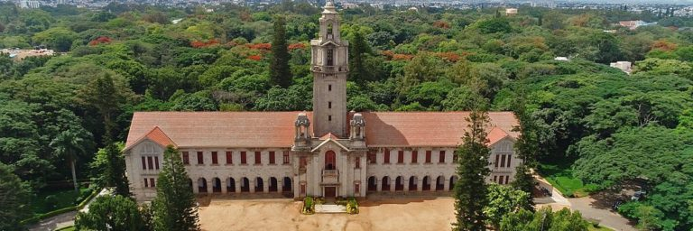
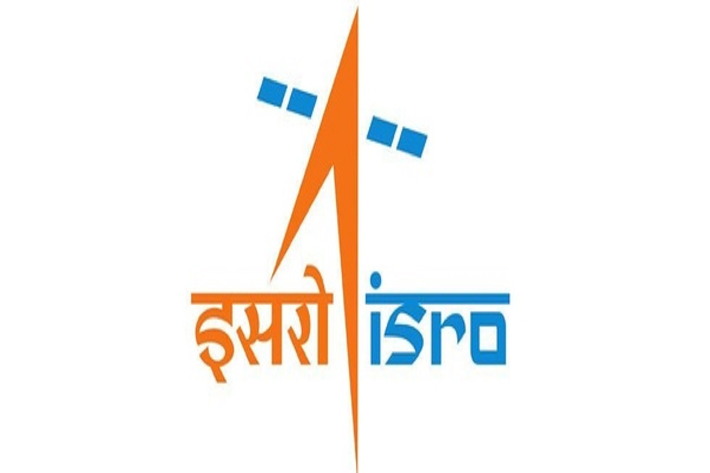

**Welcome to our research group! We are part of the Department of Physics at IISc Bangalore, India. We are interested in how optical states propagate along intricately designed photonic networks. We create such devices in our lab using femtosecond laser pulses and explore novel light-matter interactions with incredible precision and controllability. Find more details on the above tabs.**

**Contact <a href="https://sebabrata-mukherjee.github.io/seba.html" target="_blank">Sebabrata Mukherjee</a> if you have interests in pursuing cutting-edge research in photonics, condensed matter physics, quantum physics, and nonlinear dynamics.** 

 

## Recent News
- Check out our recent work on <a href="https://doi.org/10.1364/OPTICA.494823" target="_blank">Period-doubled Floquet solitons </a> published in Optica.
- IOE postdoc Dr. Shailja Sharma is joining our group. Welcome Shailja!
- Welcome Trideb (Int. PhD) and Avinash (PhD), new members of our group!
- Check out our recent work on <a href="https://doi.org/10.1103/PhysRevX.11.041057" target="_blank">**nonlinear** topological edge states </a> published in Physical Review X.
- Undergraduate student Sanjay S is joining our group. Welcome, Sanjay!
- Ph.D. student Gayathry R is joining our group. Welcome, Gayathry!

 

## Photo - IISc main building

(source: google images)

 

 
 

