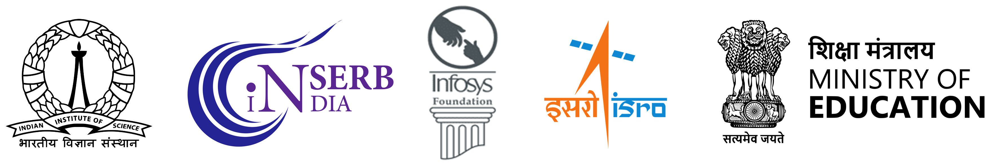
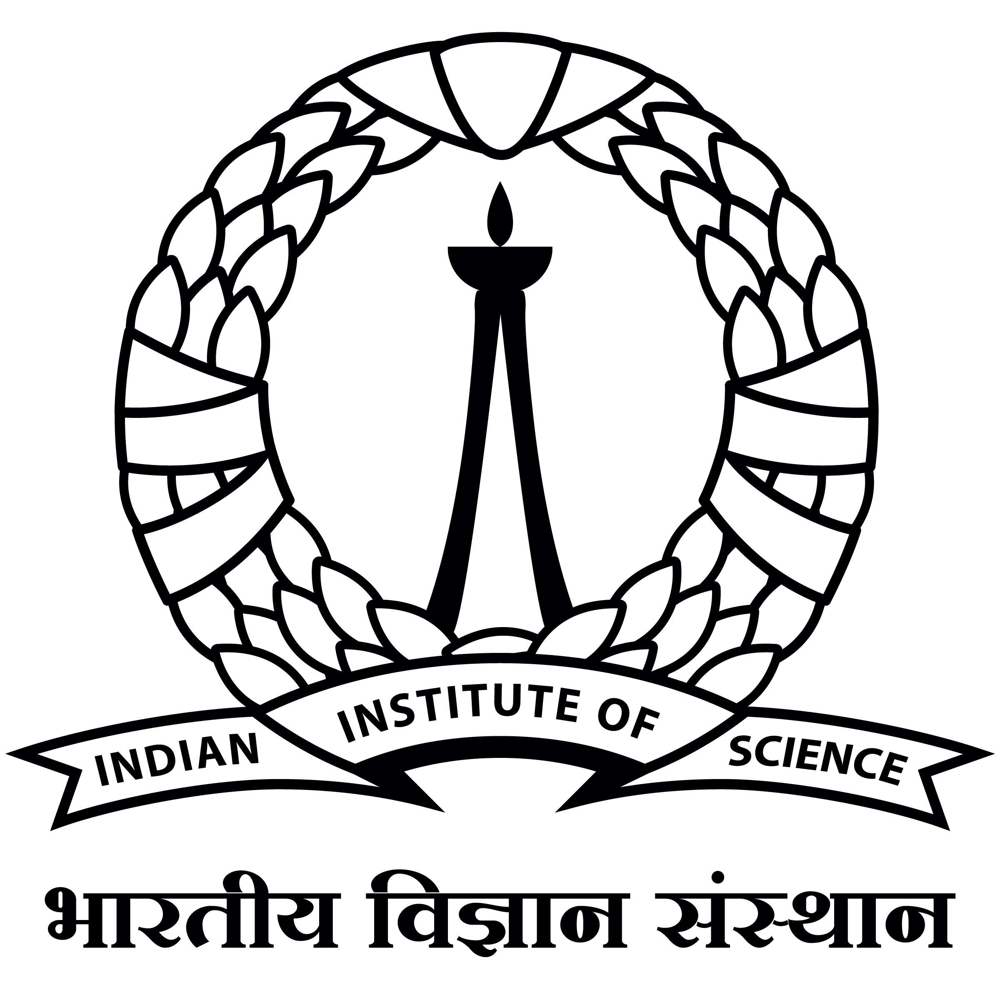
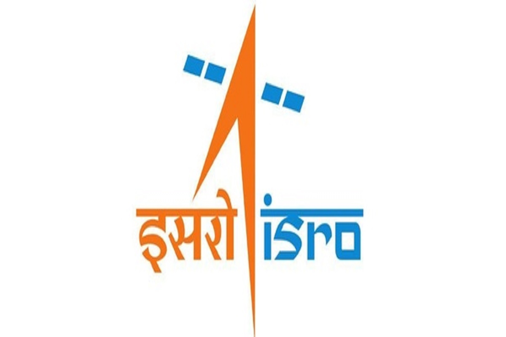

<!-- 
TOP SINGLE-COLUMN INTRO 

--!>

<!-- TWO-COLUMN SECTION -->
<table width="100%" border="0" cellspacing="0" cellpadding="0"
       style="border-collapse:collapse; border:none; background-color: transparent;">
<tr style="border:none;">

<!--             -->
<!-- LEFT COLUMN -->
<!--             -->

<!-- LEFT COLUMN -->
<td width="30%" valign="top" style="border:none; padding-right:30px;">

    

    Assistant Professor  
    Department of Physics  
    IISc Bangalore, India  
    ✉️ <a href="mailto:mukherjee@iisc.ac.in">mukherjee@iisc.ac.in</a> 
    ☎️ +91 8022932065

 

  

    
  

  

    
  

  

    
  

</td>

<!--             -->
<!-- RIGHT COLUMN -->
<!--             -->

<td width="75%" valign="top"
    style="border:none; padding-left:30px;">

<strong>
Welcome to our research group!
We are part of the Department of Physics at IISc Bangalore, India.
We are interested in how optical states propagate along intricately designed photonic networks.
We create such devices in our lab using femtosecond laser pulses and explore novel light-matter
interactions with incredible precision and controllability.
Find more details on the above tabs.
</strong>

Contact
<a href="https://sebabrata-mukherjee.github.io/seba.html" target="_blank">
Sebabrata Mukherjee
</a>
if you are interested in pursuing cutting-edge research in photonics,
condensed matter physics, quantum physics, and nonlinear dynamics.

<h3>Photo – IISc Main Building</h3>

(source: google images)

<!--             -->
<!--             -->

<h3>Recent News</h3>

  <ul>
    <li>Check out our recent experiments on
      <a href="https://doi.org/10.1103/9jjd-vbp1" target="_blank">Topological Anderson Transition</a>
    </li>
    <li>Check out our recent work on
      <a href="https://doi.org/10.1364/OL.546876" target="_blank">photonic s-p orbitals</a>
    </li>
    <li>Congratulations, Avinash, on winning the Poster Award at Photonics 2024, IIT Kharagpur</li>
    <li>Congratulations, Bhoomija, on winning the Poster Award at WOPI 2024, IIT Bombay</li>
    <li>Check out our recent work on
      <a href="https://doi.org/10.1364/OPTICA.494823" target="_blank">Period-doubled Floquet solitons</a> published in <em>Optica</em>
    </li>
    <li>IOE postdoc Dr. Shailja Sharma is joining our group. Welcome Shailja!</li>
    <li>Welcome Trideb (Int. PhD) and Avinash (PhD), new members of our group!</li>
    <li>Check out our recent work on
      <a href="https://doi.org/10.1103/PhysRevX.11.041057" target="_blank"><strong>nonlinear</strong> topological edge states</a> published in <em>Physical Review X</em>
    </li>
    <li>Undergraduate student Sanjay S is joining our group. Welcome, Sanjay!</li>
    <li>Ph.D. student Gayathry R is joining our group. Welcome, Gayathry!</li>
  </ul>

<!-- end of your right column content -->
</td>
</tr>

<!-- SINGLE-COLUMN LOGO AT THE END -->
<tr>
  <td colspan="2" align="center" style="padding-top:30px; border:none; background-color: transparent;">
    
  </td>
</tr>

<!---
**Welcome to our research group! We are part of the Department of Physics at IISc Bangalore, India. We are interested in how optical states propagate along intricately designed photonic networks. We create such devices in our lab using femtosecond laser pulses and explore novel light-matter interactions with incredible precision and controllability. Find more details on the above tabs.**

**Contact <a href="https://sebabrata-mukherjee.github.io/seba.html" target="_blank">Sebabrata Mukherjee</a> if you have interests in pursuing cutting-edge research in photonics, condensed matter physics, quantum physics, and nonlinear dynamics.** 

 

## Recent News
- Check out our recent experiments on <a href="https://doi.org/10.1103/9jjd-vbp1" target="_blank"> Topological Anderson Transition </a>
- Check out our recent work on <a href="https://doi.org/10.1364/OL.546876" target="_blank"> photonic s-p orbitals </a> 
- Congratulations, Avinash, on winning the Poster Award at Photonics 2024, IIT Kharagpur
- Congratulations, Bhoomija, on winning the Poster Award at WOPI 2024, IIT Bombay
- Check out our recent work on <a href="https://doi.org/10.1364/OPTICA.494823" target="_blank">Period-doubled Floquet solitons </a> published in Optica.
- IOE postdoc Dr. Shailja Sharma is joining our group. Welcome Shailja!
- Welcome Trideb (Int. PhD) and Avinash (PhD), new members of our group!
- Check out our recent work on <a href="https://doi.org/10.1103/PhysRevX.11.041057" target="_blank">**nonlinear** topological edge states </a> published in Physical Review X.
- Undergraduate student Sanjay S is joining our group. Welcome, Sanjay!
- Ph.D. student Gayathry R is joining our group. Welcome, Gayathry!

 

## Photo - IISc main building

(source: google images)

 

<!---

 
 

 
 

--->

