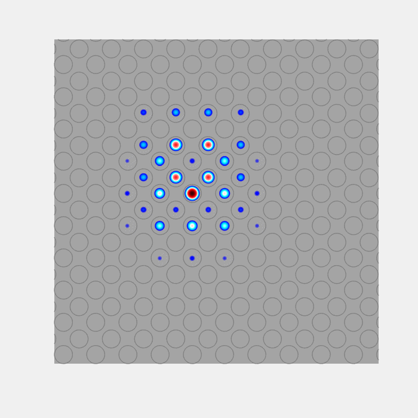

## test

<table>
  <tr>
    <td><b style="font-size:15px"></b></td>
    <td><b style="font-size:15px"></b></td>
 </tr>
<th> Femtosecond laser writing </th>
<th> State-recycling </th>
<th> Floquet soliton </th>
 <tr>
  <td>  </td>   
  <td>  </td> 
  <td>  </td> 
</td>
</tr>
</table>

<table>
<th>Femtosecond laser writing </th>
<th>State-recycling </th>
 <tr>
  <td align="center"> </td>   
  <td align="center"> </td> 
</td>
</tr>
</table>

<table>
 <tr>
    <td><b style="font-size:30px"></b></td>
    <td><b style="font-size:30px"></b></td>
 </tr>
 <tr>
    <td>  </td>   
    <td>
      
- **Education** 
  - Ph.D. Physics, Heriot-Watt University, Edinburgh, UK (2016) 
  - M.Sc. Physics, IIT Delhi, New Delhi, India (2012) 
  - B.Sc. Physics (Hons), University of Calcutta, India (2010)

- **Employment** 
  - Assistant Professor: IISc Bangalore, India; starting on 09/2021
  - Postdoctoral Scholar: Penn State University, PA, USA; 11/2018 to 08/2021.
  - Research Associate: Heriot-Watt University, Edinburgh, UK; 10/2016 to 10/2018
  - Project Associate: Indian Institute of Technology Delhi, India; 11/2012 to 08/2013
</td>
 </tr>
</table>

    

