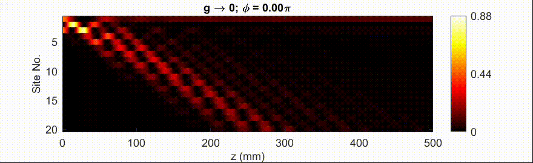
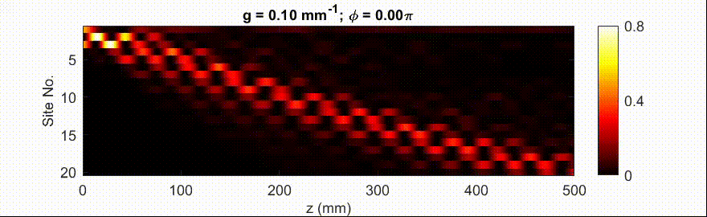
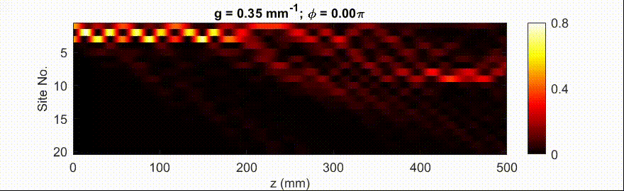

## Probing Two-body Bound States in the Continuum and Nonlinear Breathers Using Intensity Correlations
## supplementary movies

Supplementary Movie 1: The linear ($g\! \rightarrow \! 0$) propagation of optical intensity in the SSH lattice for the two-site initial excitation at waveguides 1 and 3 with relative phase $\phi$ indicated on the top. The field of view is smaller than the actual numerics, where $50$ waveguides were considered. Here, we have considered experimentally realized values of $J_{1, 2}$.

Supplementary Movie 2: Nonlinear propagation at $g= 0.1$ mm$^{-1}$, otherwise same as Supplementary Movie 1. 
Notice the formation of long-lived discrete breathers near $\phi=(0.9 \pm 0.4)\pi$ and $\phi=(1.65 \pm 0.1)\pi$.

Supplementary Movie 3: Nonlinear propagation at $g= 0.35$ mm$^{-1}$, otherwise same as Supplementary Movie 1. Notice that the dynamics is more sensitive to relative phase $\phi$, and  localized nonlinear edge modes are formed only for a few specific values (not for a wide range) of the relative phase $\phi$. 

