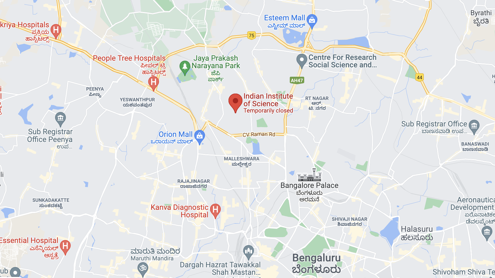

### Contacts

### Office address

Department of Physics, F2-04  
Indian Institute of Science Bangalore  
Bangalore, 560012 India  

Email: mukherjeesebabrata@gmail.com  
Phone: 

### IISc Bangalore address

IISc Main Campus  
C V Raman Avenue, Bangalore  
Karnataka, 560012 India 

[**Website**](https://iisc.ac.in/)

[**How to reach IISc**](https://iisc.ac.in/about/general-information/how-to-reach-iisc/)  

Map 

