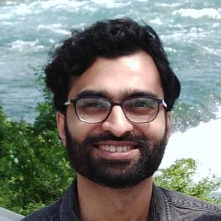
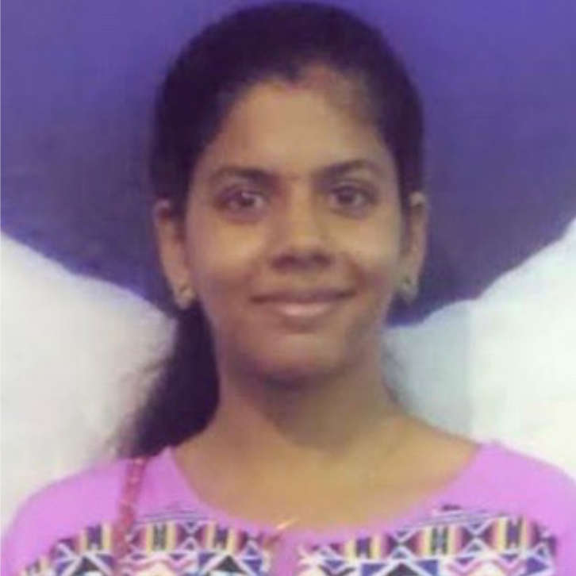
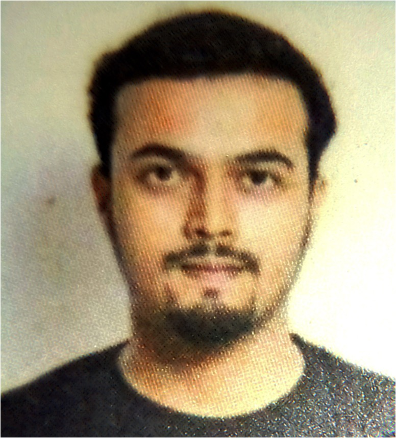
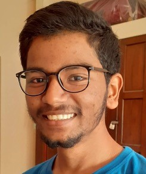
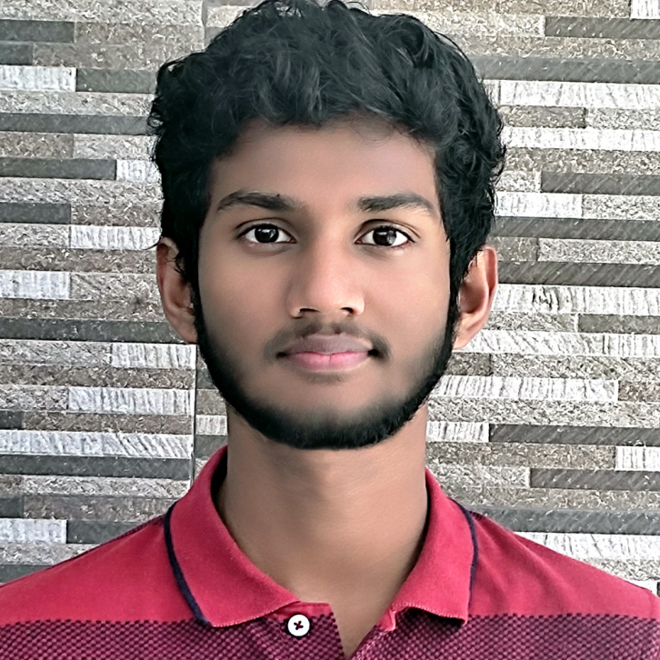

### Members

   

PI: Sebabrata Mukherjee <a href="https://sebabrata-mukherjee.github.io/seba.html" target="_blank">(brief CV)</a>  
Assistant Professor  
Email: mukherjee@iisc.ac.in  
Phone: +91 80 2293 2065 (office)

  

Gayathry R (Ph.D. Student)  
Email: gayathryr@iisc.ac.in  

  

Rishav Hui (Ph.D. Student)  
Email: rishavhui@iisc.ac.in  

  

Avinash Tetarwal (Ph.D. Student)  
Email: avinasht@iisc.ac.in  

  

Trideb Shit (Int. PhD Intern)  
Email: tridebshit@iisc.ac.in  

1. Trideb Shit, (Int-PhD, Intern, May-July 2022)
2. Subhabhan Roy, (Int-PhD, Intern, May-July 2022)
3. Mr. Sanjay S (UG, IISc, Project course, Aug-Dec 2021) 

<!---
  

Sanjay S (Undergraduate Student)  
Email: sanjays1@iisc.ac.in  
---->
