### Members

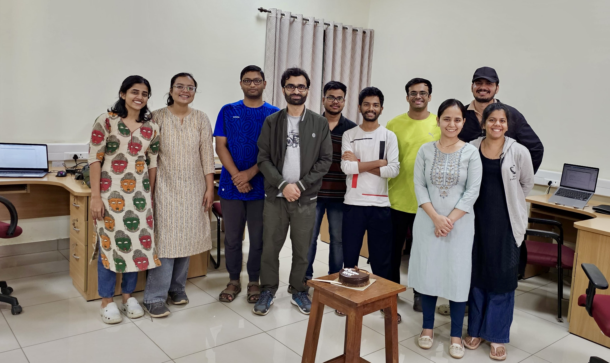   

<a href="https://sebabrata-mukherjee.github.io/photos.html" target="_blank"> Photo gallery </a>  
 

PI: Sebabrata Mukherjee <a href="https://sebabrata-mukherjee.github.io/seba.html" target="_blank">(brief CV)</a>  
Email: mukherjee@iisc.ac.in  
Phone: +91 80 2293 2065 (office)

### Ph.D. students

1. Gayathry Rajeevan, <a href="https://scholar.google.com/citations?hl=en&user=eO-XvxQAAAAJ" target="_blank">Google Scholar</a>, gayathryr@iisc.ac.in  
2. Rishav Hui, <a href="https://scholar.google.com/citations?hl=en&user=om2oK2EAAAAJ" target="_blank">Google Scholar</a>, rishavhui@iisc.ac.in  
3. Trideb Shit, <a href="https://scholar.google.com/citations?hl=en&user=kg3xraQAAAAJ" target="_blank">Google Scholar</a>, tridebshit@iisc.ac.in  
4. Avinash Tetarwal, <a href="https://scholar.google.com/citations?hl=en&user=KqVulrAAAAAJ" target="_blank">Google Scholar</a>, avinasht@iisc.ac.in  
5. Bhoomija Chaurasia, bhoomijac@iisc.ac.in  
6. Debankur Basak, debankurb@iisc.ac.in  
7. Rudra Khanra, rudrakhanra@iisc.ac.in  

### Undergraduate students
1. Avik Das  
2. Aaitijhya Goswami  

### Previous members

**Postdoc:**  
10. Shailja Sharma, IoE Post-Doctoral Fellow, *currently a faculty member at NIT Hamirpur*  

**BS-MS Thesis**  
9. Abhinav Sinha, BS and MS thesis, *currently pursuing PhD at McGill University, Canada*  
8. Archit Gajera, BS thesis  

**Interns:**   
7. Anamitra Giri, Summer internship, 2025, *MSc IIT Kharagpur*  
6. Mrinmoy Das, Summer internship, 2025, *MSc IIT Kharagpur*  
5. Maitri Ganguli, (Int-PhD, May-July 2023) *currently pursuing PhD at University of Illinois Urbana Champaign*  
4. Karnpriya Pandey, (Int-PhD, May-July 2023)  
3. Trideb Shit, (Int-PhD, May-July 2022)  
2. Subhabhan Roy (Int-PhD, May-July 2022)  
1. Sanjay S (UG, IISc, Project course, Aug-Dec 2021)  

<table border="0">
 <tr>
        <td>  
            

                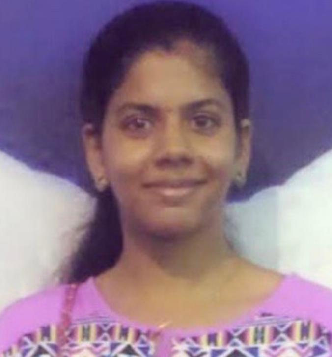  
                 <a href="https://scholar.google.com/citations?hl=en&user=eO-XvxQAAAAJ" target="_blank">Gayathry Rajeevan</a>  
                 gayathryr@iisc.ac.in  
             

        </td>
        <td>
            

               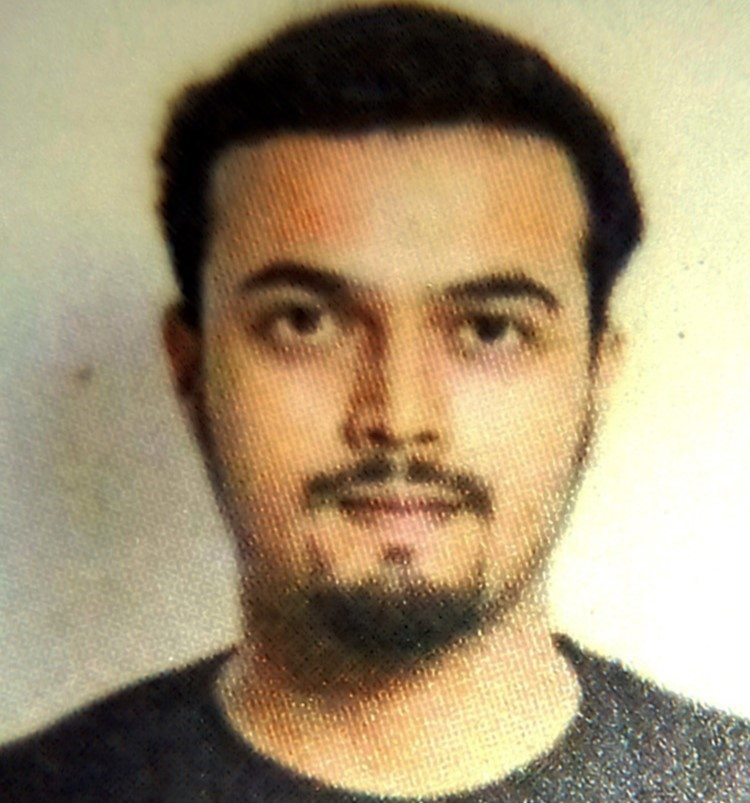  
                 <a href="https://scholar.google.com/citations?hl=en&user=om2oK2EAAAAJ" target="_blank">Rishav Hui</a>  
                 rishavhui@iisc.ac.in  
             

        </td>
         <td>
            

             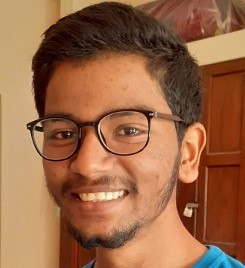  
             <a href="https://scholar.google.com/citations?hl=en&user=kg3xraQAAAAJ" target="_blank">Trideb Shit</a>  
             tridebshit@iisc.ac.in  
             

         </td>
 </tr>
</table>
 

<table border="0">
 <tr>
         <td>
            

              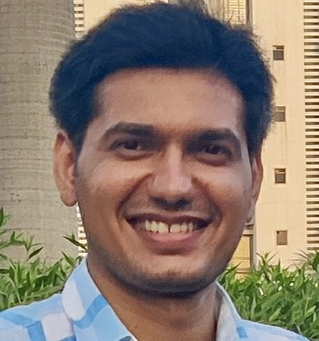  
              <a href="https://scholar.google.com/citations?hl=en&user=KqVulrAAAAAJ" target="_blank">Avinash Tetarwal</a>  
              avinasht@iisc.ac.in  
             

         </td>
          <td>
            

                 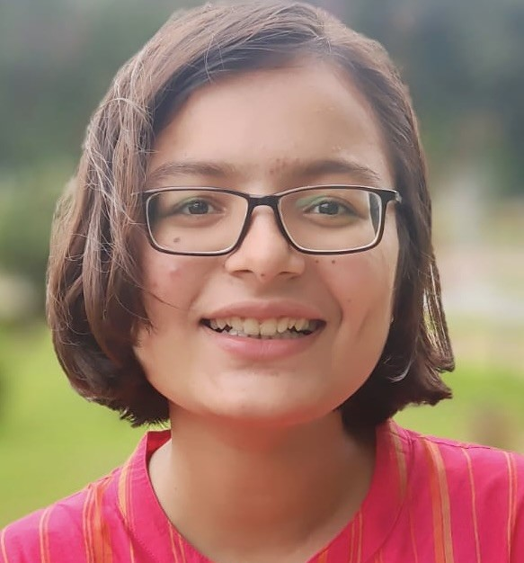   
                  Bhoomija Chaurasia   
                  bhoomijac@iisc.ac.in  
            

        </td>
        <td>
            

                 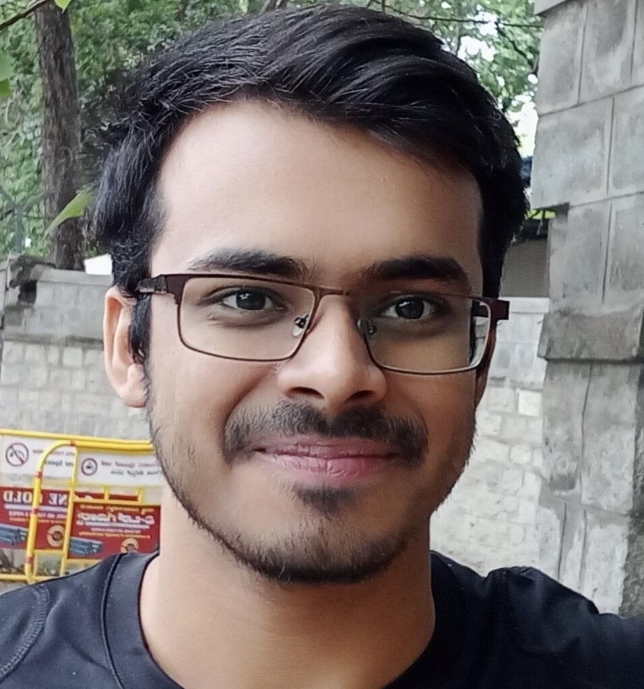   
                  Debankur Basak   
                  debankurb@iisc.ac.in  
            

        </td>
 </tr>
</table>
 

### Project Associate

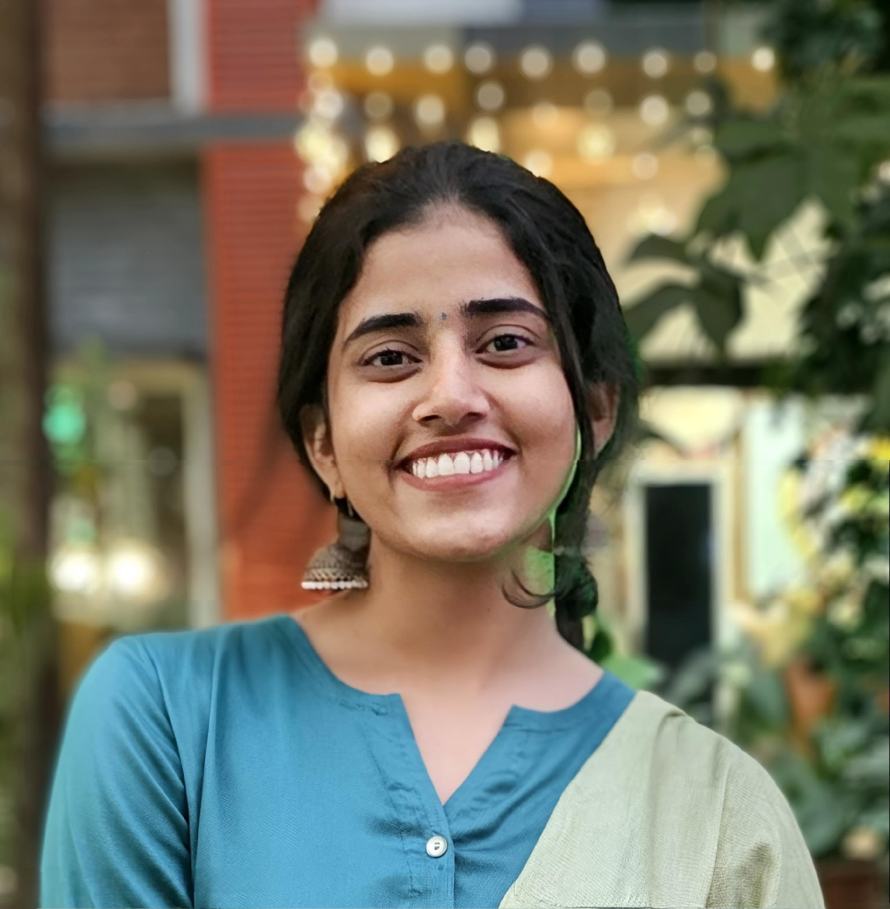   
Catherine Metto   
catherinem@iisc.ac.in  
       

         
### Undergraduate students
<table border="0">
 <tr>
        <td>  
            

                 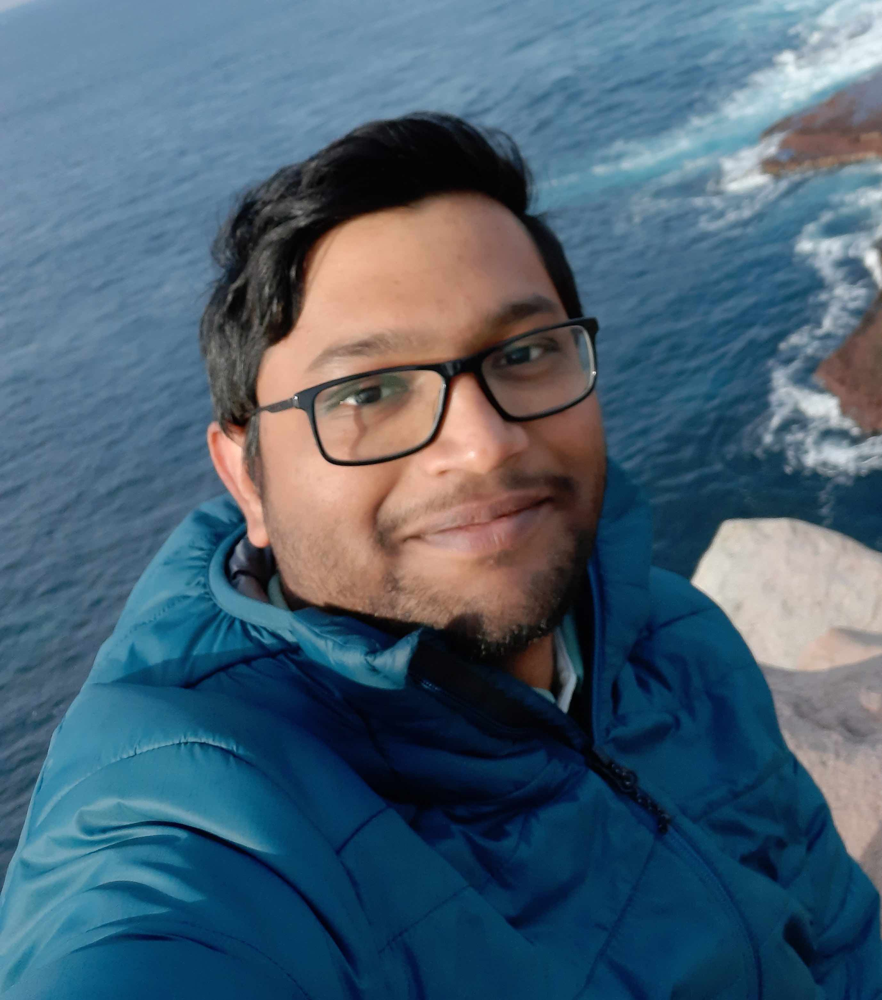   
                  Abhinav Sinha   
                  abhinavsinha@iisc.ac.in  
            

        </td>
        <td>
            

                 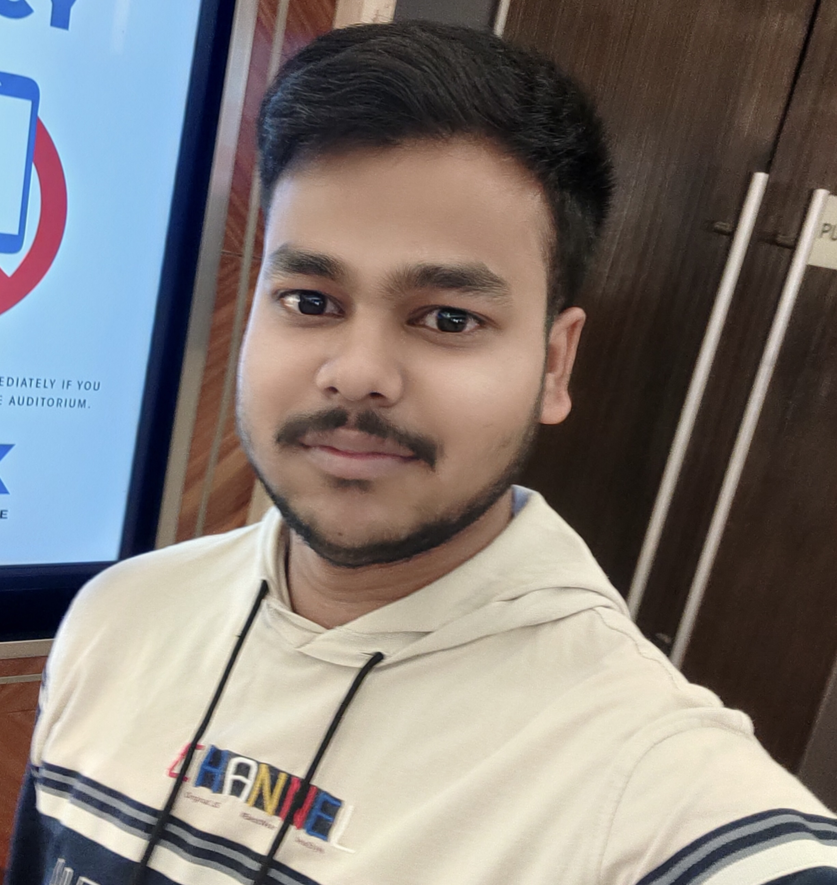   
                  Rudra Khanra   
                  rudrakhanra@iisc.ac.in  
            

        </td>
        <td>
            

                 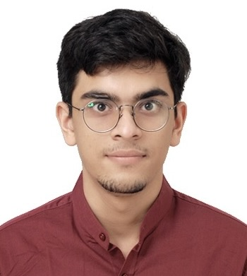   
                  Archit Gajera   
                  architgajera@iisc.ac.in  
            

        </td>
 </tr>
</table>
 

<!---
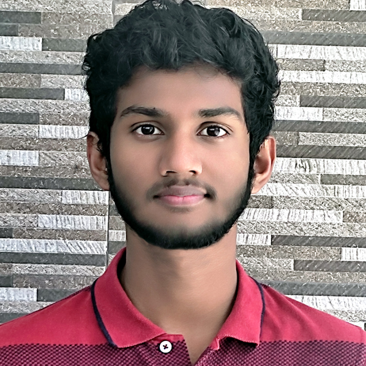  

Sanjay S (Undergraduate Student)  
Email: sanjays1@iisc.ac.in  
---->

<!---

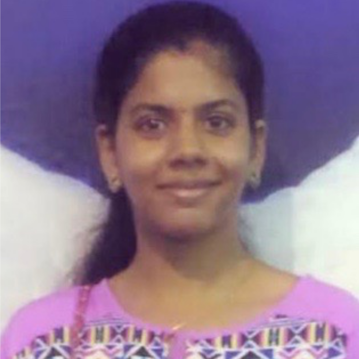  
Gayathry R (Ph.D. Student)  
Email: gayathryr@iisc.ac.in  

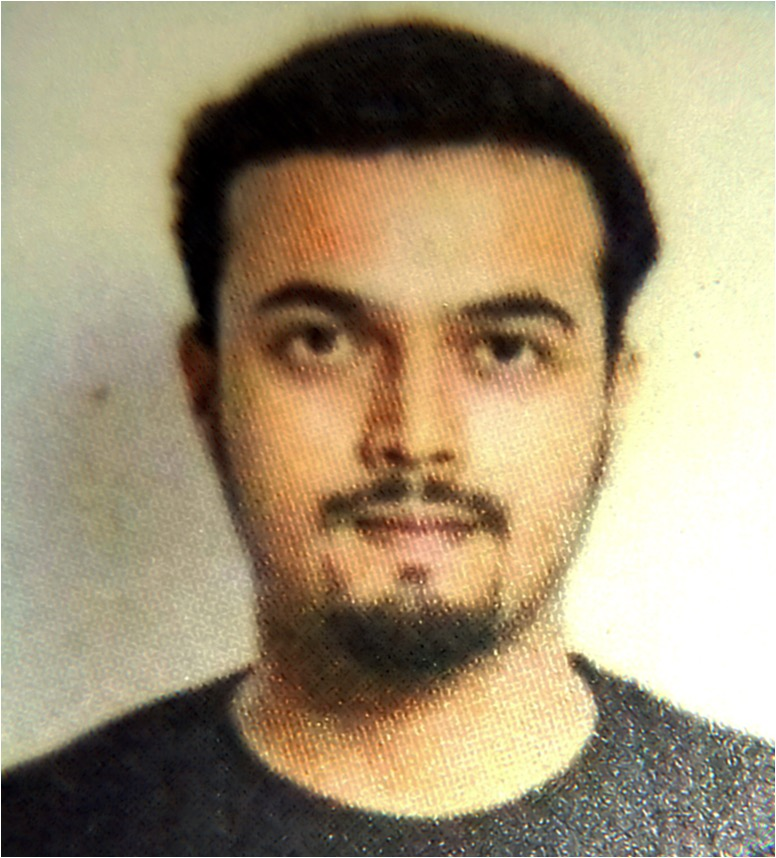  
Rishav Hui (Ph.D. Student)  
Email: rishavhui@iisc.ac.in  

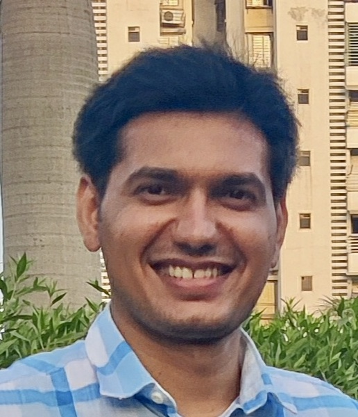  
Avinash Tetarwal (Ph.D. Student)  
Email: avinasht@iisc.ac.in  

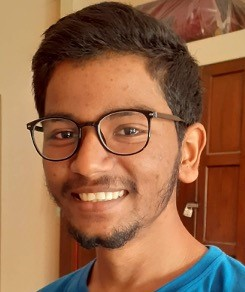  
Trideb Shit (Int. PhD Intern)  
Email: tridebshit@iisc.ac.in  

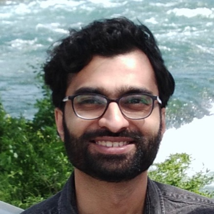   
PI: Sebabrata Mukherjee <a href="https://sebabrata-mukherjee.github.io/seba.html" target="_blank">(brief CV)</a>  
Email: mukherjee@iisc.ac.in  
Phone: +91 80 2293 2065 (office)

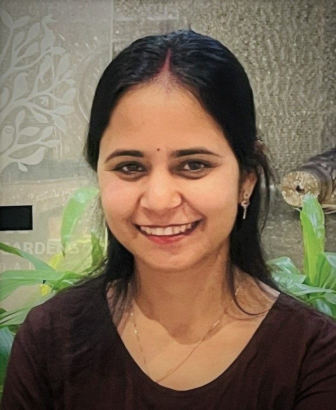   
Shailja Sharma   
IoE Post-Doctoral fellow   
Email: shailjas@iisc.ac.in  

--->
