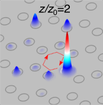
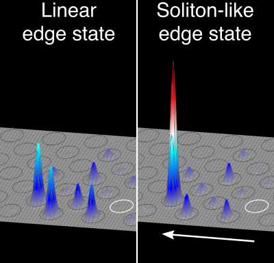

### Publications

 
<a href="https://orcid.org/0000-0003-1942-2521" target="_blank">
 

  
   
  
  
<!--**Recent**   -->
- Abhinav Sinha, Trideb Shit, Avinash Tetarwal, Diptiman Sen, Sebabrata Mukherjee, "Probing Topological Anderson Transition in Quasiperiodic Photonic Lattices via Chiral Displacement and Wavelength Tuning," 
<a href="https://arxiv.org/abs/2503.07175" target="_blank">arXiv:2503.07175 (2025)</a>

- Gayathry Rajeevan and Sebabrata Mukherjee, "Nonlinear Switch and Spatial Lattice Solitons of Photonic s-p Orbitals," <a href="https://arxiv.org/abs/2408.03250" target="_blank">arXiv:2408.03250 (2024)</a>
<a href="[https://arxiv.org/abs/2408.03250](https://doi.org/10.1364/OL.546876)" target="_blank">Optics Letters **50**(2), 297-300 (2025)</a>

- Trideb Shit, Rishav Hui, Marco Di Liberto, Diptiman Sen, and Sebabrata Mukherjee, "Probing Two-body Bound States in the Continuum and Nonlinear Breathers Using Intensity Correlations," <a href="https://arxiv.org/abs/2402.18340" target="_blank">arXiv:2402.18340 (2024)</a>,
[Supplementary movies](TS_Correlation_2024.md), <a href="https://journals.aps.org/pra/accepted/7107dYf0D421c098505009904b04c53a357842343" target="_blank">Accepted for publication in Physical Review A (2025)</a>

- Christina Jörg, Marius Jürgensen, Sebabrata Mukherjee, and Mikael C. Rechtsman, "Optical control of topological end states via soliton formation in a 1D lattice," [Nanophotonics (2024)](https://doi.org/10.1515/nanoph-2024-0401)

- Christopher Oliver, Sebabrata Mukherjee, Mikael C. Rechtsman, Iacopo Carusotto, and Hannah M. Price, "Artificial gauge fields in the t-z mapping for optical pulses: spatio-temporal wavepacket control and quantum Hall physics," [
Science Advances **9**, 42 eadj0360 (2023)](https://www.science.org/doi/10.1126/sciadv.adj0360) 

  
- Marius Jürgensen, Sebabrata Mukherjee, Christina Jörg and M C Rechtsman "Quantized Fractional Thouless Pumping of Solitons," [Nature Physics **19**, 420-426 (2023)](https://doi.org/10.1038/s41567-022-01871-x) 

- Sebabrata Mukherjee, and M C Rechtsman "Period-doubled Floquet Solitons," [arXiv:2208.02279 (2022)](https://arxiv.org/abs/2208.02279), 
  [Optica **10**, 1310-1315 (2023)](https://doi.org/10.1364/OPTICA.494823)  

    
<!-- **2021** -->
  
- Sebabrata Mukherjee and Mikael C. Rechtsman, "Observation of unidirectional solitonlike edge states in nonlinear Floquet topological insulators," <a href="https://doi.org/10.1103/PhysRevX.11.041057" target="_blank">Physical Review X **11**, 041057 (2021)</a>   
   
- Marius Jürgensen, Sebabrata Mukherjee, and Mikael C. Rechtsman "Quantized nonlinear Thouless pumping," <a href="https://doi.org/10.1038/s41586-021-03688-9" target="_blank">Nature **596**, 63-67 (2021)</a>
  

<!-- **2020**   -->
- Sebabrata Mukherjee and Mikael C. Rechtsman, "Observation of Floquet Solitons in a Topological Band Gap," <a href="https://doi.org/10.1126/science.aba8725" target="_blank">Science **368**, 856 (2020).</a> Perspective by <a href="https://science.sciencemag.org/content/368/6493/821" target="_blank">Ablowitz and Cole, Science **368**, 821 (2020).</a>  Press release: <a href="https://news.psu.edu/story/621552/2020/05/28/research/geometry-intricately-fabricated-glass-makes-light-trap-itself" target="_blank">Penn State News,</a> <a href="https://phys.org/news/2020-06-geometry-intricately-fabricated-glass.html" target="_blank">Phys.org</a>   
  
- Alexander Cerjan, Marius Jürgensen, Wladimir A. Benalcazar, Sebabrata Mukherjee, and
Mikael C. Rechtsman, "Observation of a higher-order topological bound state in the
continuum", [Physical Review Letters **125**, 213901 (2020)](https://doi.org/10.1103/PhysRevLett.125.213901). Editors' Suggestion

- Harikumar K Chandrasekharan, Katjana Ehrlich, Michael G. Tanner, Dionne M. Haynes,
Sebabrata Mukherjee, Tim A. Birks, and Robert R. Thomson, "Observing mode-dependent
wavelength-to-time mapping in few-mode fibers using a single-photon detector array," [APL
Photonics 5, 061303 (2020)](https://doi.org/10.1063/5.0006983)

<!-- **2019**   -->
- Marco Di Liberto, Sebabrata Mukherjee and Nathan Goldman, "Nonlinear dynamics of
Aharonov-Bohm cages," [Physical Review A 100, 043829 (2019)](https://doi.org/10.1103/PhysRevA.100.043829).

- David W. Canning, Ross J. Donaldson, Sebabrata Mukherjee, Ross J. Collings, Luca Mazzarella,
Ugo Zanforlin, John Jeers, Robert R. Thomson, and Gerald S. Buller, "On-chip implementation
of the probabilistic quantum optical state comparison amplifer," [Optics Express **27** (22), 31713-
31726 (2019)](https://doi.org/10.1364/OE.27.031713)

<!-- **2018**   -->
- Sebabrata Mukherjee, Marco Di Liberto, Patrik Öhberg, Robert R. Thomson, and Nathan
Goldman, "Experimental Observation of Aharonov-Bohm Cages in Photonic Lattices," [Physical Review Letters **121**, 075502 (2018)](https://doi.org/10.1103/PhysRevLett.121.075502). Highlighted on the cover page of [Physical Review Letters **121** (7)](https://journals.aps.org/prl/issues/121/7).

- Sebabrata Mukherjee, Harikumar K. Chandrasekharan, Patrik Öhberg, Nathan Goldman and
Robert R. Thomson, "State-recycling and time-resolved imaging in topological photonic lattices," [Nature Communications **9**, 4209 (2018)](https://doi.org/10.1038/s41467-018-06723-y). Press release: [BBC News](https://www.bbc.com/news/uk-scotland-46070122?SThisFB&fbclid=IwAR3Ln2qR31mAFf4uhu81kmCbJ13mMbOYWxq6Sm19EIHwQQM-ISZu1ALAscA).

- Camilo Cantillano, Sebabrata Mukherjee, Luis Morales-Inostroza, Bastian Real, Gabriel Caceres-
Aravena, Carla Hermann-Avigliano, Robert R. Thomson, and Rodrigo A. Vicencio, "Observation
of Ground and Excited Flat Band States in Graphene Photonic Ribbons," [New Journal of Physics
**20**, 033028 (2018)](https://doi.org/10.1088/1367-2630/aab483)

<!-- **2017**   -->
- Sebabrata Mukherjee, Alexander Spracklen, Manuel Valiente, Erika Andersson, Patrik Öhberg,
Nathan Goldman, and Robert R. Thomson, "Experimental observation of anomalous topological edge modes in a slowly driven photonic lattice," [Nature Communications **8**, 13918 (2017)](https://doi.org/10.1038/ncomms13918).

- Sebabrata Mukherjee, Dmitri Mogilevtsev, Gregory Ya Slepyan, Thomas H. Doherty, Robert
R. Thomson, and Natalia Korolkova, "Dissipatively coupled waveguide networks for coherent
diffusive photonics," [Nature Communications **8**, 1909 (2017)](https://doi.org/10.1038/s41467-017-02048-4)

- Sebabrata Mukherjee, and Robert R. Thomson, "Observation of robust flat-band localization in 
driven photonic rhombic lattices," [Optics Letters **42** (12) 2243-2246 (2017)](https://doi.org/10.1364/OL.42.002243)

<!-- **2016**   -->
- Sebabrata Mukherjee, Manuel Valiente, Nathan Goldman, Alexander Spracklen, Erika
Andersson, Patrik Öhberg, and Robert R. Thomson, "Observation of pair tunneling and
coherent destruction of tunneling in arrays of optical waveguides," [Physical Review A 94 (5),
053853 (2016)](https://doi.org/10.1103/PhysRevA.94.053853)

- Yves Bellouard, Audrey Champion, Benjamin McMillen, Sebabrata Mukherjee, Robert
R. Thomson, Charles Pepin, Philippe Gillet, and Ya Cheng, "Stress-state manipulation in
fused silica via femtosecond laser irradiation," [Optica 3 (12), 1285-1293 (2016)](https://doi.org/10.1364/OPTICA.3.001285)

<!-- **2015**   -->

- Sebabrata Mukherjee and Robert R. Thomson, "Observation of localized flat-band modes in a
quasi-one-dimensional photonic rhombic lattice," [Optics Letters **40** (23), 5443-5446 (2015)](https://doi.org/10.1364/OL.40.005443)

- Sebabrata Mukherjee, Alexander Spracklen, Debaditya Choudhury, Nathan Goldman, Patrik
Öhberg, Erika Andersson, and Robert R. Thomson, "Modulation-assisted tunneling in laserfabricated
photonic Wannier-Stark ladders," [New Journal of Physics **17**, 115002 (2015)](https://doi.org/10.1088/1367-2630/17/11/115002)

- Sebabrata Mukherjee, Alexander Spracklen, Debaditya Choudhury, Nathan Goldman, Patrik Öhberg, Erika Andersson and Robert R. Thomson,, "Observation of a localized flat-band state in a photonic Lieb lattice," [Physical Review Letters **114**, 245504 (2015)](https://doi.org/10.1103/PhysRevLett.114.245504). Featured in Physics & Editors' Suggestion. Viewpoint in Physical Review Letters [doi:10.1103/Physics.8.55](https://physics.aps.org/articles/v8/55).   News & Views in Nature Materials [doi:10.1038/nmat4378](https://doi.org/10.1038/nmat4378)

<!-- **2014**   -->
- Alexander Arriola, Sebabrata Mukherjee, Debaditya Choudhury, Lucas Labadie, and Robert R. Thomson, 
"Ultrafast laser inscription of mid-IR directional couplers for stellar interferometry,"
[Optics Letters **39** (16), 4820-4822 (2014)](https://doi.org/10.1364/OL.39.004820)

