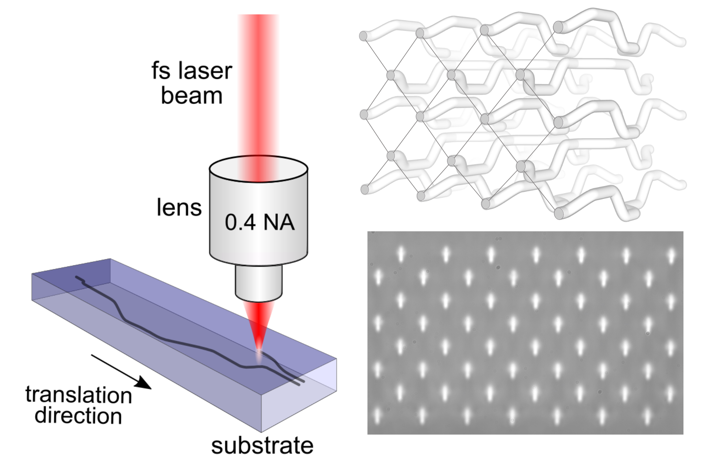

### Research

Our goal is to apply photonic technologies to discover new physics and find their applications, going beyond the traditional scope of 
optics and condensed matter physics. We study how optical states propagate along intricately designed waveguide networks that are 
created inside a few cm long glass substrates using femtosecond laser pulses.  

Our current research topics include  

    - Manipulating light transport in evanescently coupled waveguide arrays,
    - Micro-optic device fabrication using femtosecond laser pulses, 
    - Periodically modulated (Floquet) photonic structures,
    - Photonic topological insulators,
    - Optical Kerr nonlinearity 
    
**Floquet engineering & Photonic topological insulators**  
Coming soon...  

**Nonlinear/interacting topological photonics**  
Coming soon...  

**Femtosecond laser writing**  
Under certain conditions, focused sub-picosecond laser pulses can drive nonlinear absorption processes inside transparent dielectric materials. The nonlinear processes can cause various types of permanent structural modifications that are strongly influenced by the exposure conditions and material properties. For glass substrates such as fused silica and borosilicate, it is possible to achieve a permanent positive refractive index modification of the order of 0.0001.  

Because of the nonlinear nature of the interaction, such refractive index modifications occur only near the focal volume of the laser beam. Hence, by translating the substrate, we can inscribe (or directly write) three-dimensional structures that can act as optical waveguides. To fabricate each optical waveguide, a glass substrate is mounted on high precision x-y-z stages and then translated through the focus of the laser beam. Using these high precision stages, the inter-waveguide spacing can be controlled on the scale of a few tens of nanometers - enabling precise control of the evanescent coupling strength, which determines the tunneling of optical waves to the nearest waveguides. The analogous on-site energy (i.e., refractive index modification) can be controlled either by varying pulse energy or translation speed of fabrication.

Schematic of femtosecond laser writing (left). Micrograph of a single mode waveguide (cross-section) at 1030 nm and the guided mode (right).

