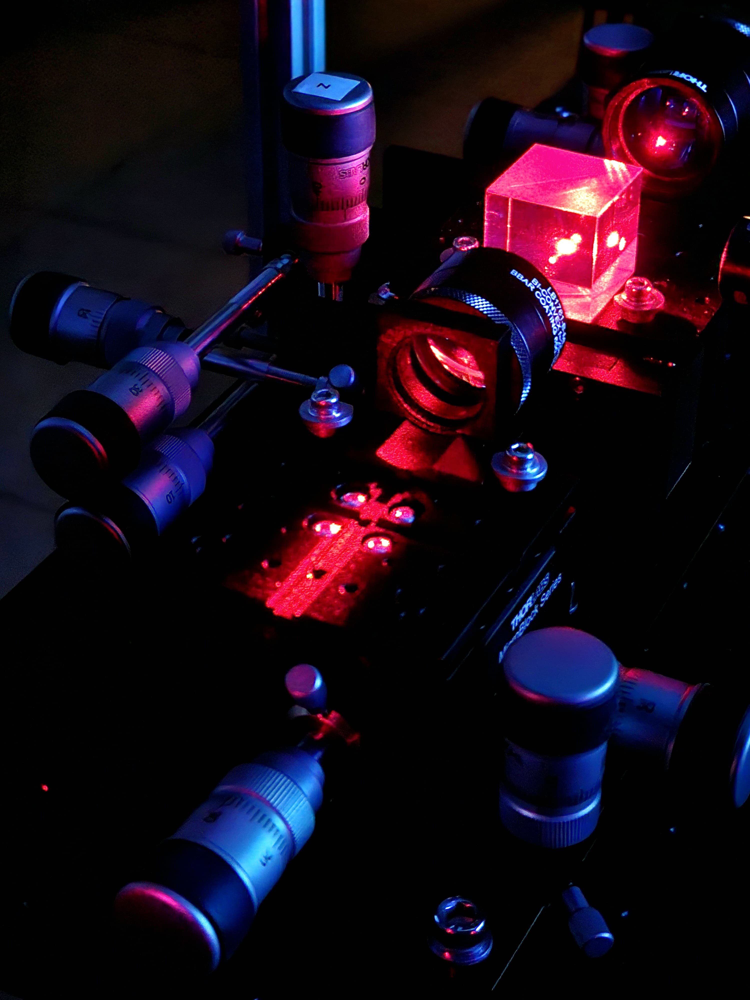

### Research

**Keywords:** Optics, condensed matter physics, femtosecond laser writing, photonic lattices,
periodically modulated (Floquet) waveguide arrays, linear and nonlinear topological photonics, spatial solitons.

We are interested in how optical states propagate along intricately designed waveguide networks and in creating these devices to explore novel light-matter interactions. Our goal is to apply photonic technologies to discover new physics and find their applications, going beyond the traditional scope of 
optics and condensed matter physics.  

Our current research topics include 

   - Femtosecond laser writing,
   - Photonic topological materials,
   - Light transport in evanescently coupled waveguide lattices,
   - Periodically modulated (Floquet) photonic structures,
   - Optical Kerr nonlinearity and discrete solitons,
   - Micro-optic device fabrication
     

### Floquet engineering

Floquet engineering (i.e., applying a 'time'-periodic driving to a static system) is a convenient way of creating novel Hamiltonians, realizing synthetic gauge fields and topologically non-trivial energy bands. Using engineered waveguide networks, we can implement various driving protocols to investigate a wide variety of phenomena known from quantum physics and condensed matter physics. One such example is the realization of topologically nontrivial materials where back-scatter immune optical states propagate unidirectionally along the edge of the device. 

See our articles on [Anomalous Floquet topological insulator,](https://doi.org/10.1038/ncomms13918) [Aharonov-Bohm caging,](https://doi.org/10.1103/PhysRevLett.121.075502) [Modulation assisted tunneling](https://doi.org/10.1088/1367-2630/17/11/115002)

### Nonlinear topological photonics
Photonic lattices -- periodic arrays of optical waveguides -- are a remarkable platform for exploring mean-field-type interactions arising from the optical Kerr effect (i.e., a variation of the refractive index in proportion to the local intensity of light). 

At high intensity, photons can *effectively* interact mediated by the ambient medium. In experiments, we temporally shape laser pulses such that the dynamics of light through the engineered waveguide arrays are governed by the discrete nonlinear Schrödinger equation (DNSE). The DNSE is mathematically equivalent to the Gross-Pitaevskii equation, which describes mean-field bosonic interactions in a Bose-Einstein condensate. Our goal is to understand and explore the role of interactions/nonlinearity in topologically nontrivial systems. 

See our article on [Floquet solitons in a topological bandgap,](https://doi.org/10.1126/science.aba8725)  
[Quantized nonlinear Thouless pumping,](https://doi.org/10.1038/s41586-021-03688-9)
[Unidirectional traveling edge solitons](https://doi.org/10.1103/PhysRevX.11.041057)

### Femtosecond laser writing
 
We use intense femtosecond laser pulses to modify optical properties (e.g., refractive index) of transparent dielectric materials. This is a unique and powerful technique for creating complex three-dimensional light-guiding structures. Femtosecond laser-written devices remain highly robust and functional at room temperature, integrating hundreds of photonic degrees of freedom on a few cm long chip. We study fundamental physical phenomena employing such devices that can have potential applications in quantum optics, telecommunication, sensing and medical science. 

See also [News: Microsoft Project Silica;](https://news.microsoft.com/innovation-stories/ignite-project-silica-superman/) further reading on [femtosecond laser writing](https://doi.org/10.1038/nphoton.2008.47) 

 

### Animations

Back-scatter immune unidirectional topological edge modes.
Red sites indicate defects.

Cyclotron-like motion of a Floquet soliton in a topological bandgap

