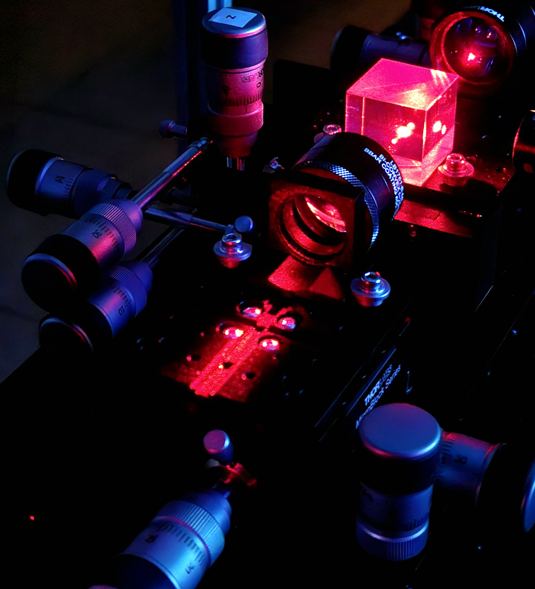
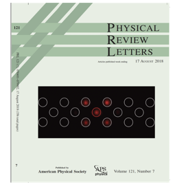
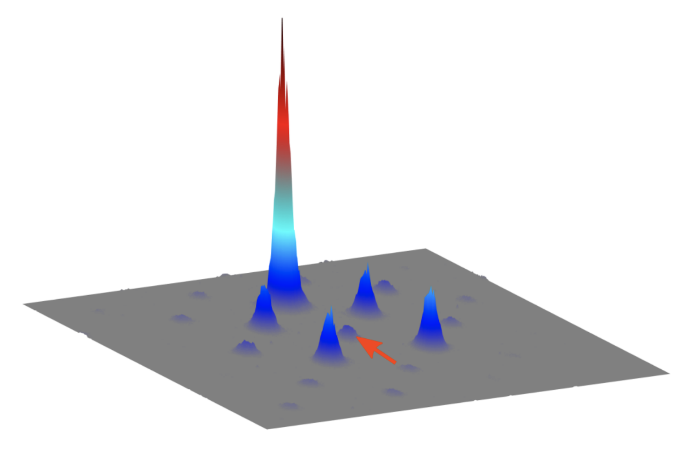
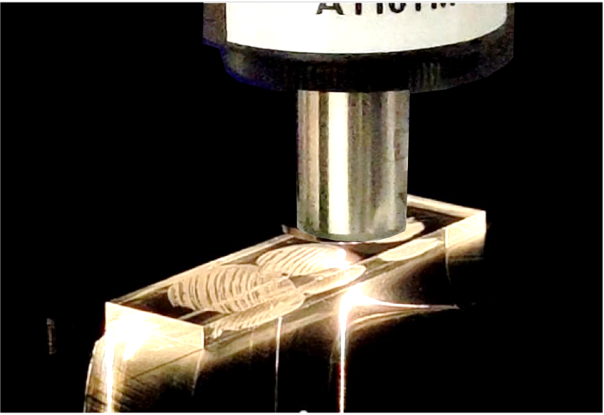
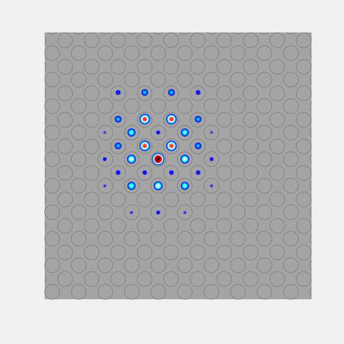

### Research

  

**Keywords:** Optics, condensed matter physics, femtosecond laser writing, photonic lattices,  
periodically modulated (Floquet) waveguide arrays, linear and nonlinear topological photonics, spatial solitons.

We are interested in how optical states propagate along intricately designed waveguide networks and in creating these devices to explore novel light–matter interactions. Our goal is to apply photonic technologies to discover new physics and find their applications, going beyond the traditional scope of optics and condensed matter physics.

Our current research topics include:
- Femtosecond laser writing
- Photonic topological materials
- Light transport in evanescently coupled waveguide lattices
- Periodically modulated (Floquet) photonic structures
- Optical Kerr nonlinearity and discrete solitons
- Micro-optic device fabrication

  

  

    
  

---

### Floquet engineering

  

Floquet engineering (i.e., applying a “time”-periodic driving to a static system) is a convenient way of creating novel Hamiltonians, realizing synthetic gauge fields, and engineering topologically non-trivial energy bands. Using intricately designed waveguide networks, we implement a variety of driving protocols to investigate phenomena known from quantum and condensed matter physics.

One prominent example is the realization of topologically non-trivial materials where back-scatter-immune optical states propagate unidirectionally along the edge of the device.

See our articles on  
[Anomalous Floquet topological insulator](https://doi.org/10.1038/ncomms13918),  
[Aharonov–Bohm caging](https://doi.org/10.1103/PhysRevLett.121.075502),  
[Modulation assisted tunneling](https://doi.org/10.1088/1367-2630/17/11/115002)

  

  

    
  

---

### Nonlinear topological photonics

  

    
  

  

Photonic lattices—periodic arrays of optical waveguides—are a powerful platform for exploring mean-field-type interactions arising from the optical Kerr effect, i.e., a variation of the refractive index proportional to the local intensity of light.

At high intensities, photons can *effectively* interact via the ambient medium. In our experiments, we temporally shape laser pulses such that the dynamics of light propagating through engineered waveguide arrays are governed by the discrete nonlinear Schrödinger equation (DNSE). The DNSE is mathematically equivalent to the Gross–Pitaevskii equation describing mean-field bosonic interactions in a Bose–Einstein condensate.

Our goal is to understand and explore the role of interactions and nonlinearity in topologically non-trivial systems.

See our articles on  
[Floquet solitons in a topological bandgap](https://doi.org/10.1126/science.aba8725)  
[Quantized nonlinear Thouless pumping](https://doi.org/10.1038/s41586-021-03688-9)  
[Unidirectional traveling edge solitons](https://doi.org/10.1103/PhysRevX.11.041057)

  

---

### Femtosecond laser writing

  

We use intense femtosecond laser pulses to permanently modify the optical properties (e.g., refractive index) of transparent dielectric materials. This unique and powerful technique enables the fabrication of complex three-dimensional light-guiding structures with sub-micron precision.

Femtosecond laser-written devices remain highly robust and functional at room temperature, integrating hundreds of photonic degrees of freedom on a few-centimeter-long chip. We study fundamental physical phenomena using such devices, with potential applications in quantum optics, telecommunication, sensing, and medical science.

See also  
[News: Microsoft Project Silica](https://news.microsoft.com/innovation-stories/ignite-project-silica-superman/)  
Further reading on [femtosecond laser writing](https://doi.org/10.1038/nphoton.2008.47)

  

  

    
  

---

### Animations

  

Back-scatter-immune unidirectional topological edge modes.  
Red sites indicate defects.

  

Cyclotron-like motion of a Floquet soliton in a topological bandgap

